# Terraform Project Documentation

## Table of Contents

1. [Introduction](#1-introduction)
2. [Prerequisites](#2-prerequisites)
3. [Directory Structure](#3-directory-structure)
4. [VPC Module](#4-vpc-module)
   - [Configuration](#vpc-modules-configuration)
   - [Outputs](#vpc-modules-outputs)
5. [Security Groups Module](#5-security-groups-module)
   - [Configuration](#security-groups-module-configuration)
   - [Outputs](#security-groups-module-outputs)
6. [Instances Module](#6-instances-module)
   - [Configuration](#instance-module-configuration)
   - [Installer Script](#installer-script)
   - [Outputs](#instance-module-outputs)
7. [Environments](#7-environments)
   - [Dev Environment](#dev-environment)
   - [Prod Environment](#prod-environment)
8. [Extras](#8-extras)
9. [Best Practices](#9-best-practices)
10. [Testing](#10-testing)
11. [Conclusion](#11-conclusion)

## 1. Introduction

This documentation provides an overview and detailed information about the Terraform project designed to deploy and manage infrastructure on AWS. The project is organized into modules for VPC creation, security groups configuration, and EC2 instances provisioning, it is also built across multiple environments (dev, and prod) each on a different region (eu-west-1 and eu-central-1) specifically, with a minimum of at least 2 availability zones, there is also a bash script to install ansible and docker on the EC2 instances. in addition there are also bash scripts to automate the Terraform commands for both environments to increase the deployment speed when necessary. The project is designed to be flexible and scalable, it can be easily adapted to fit different use cases and requirements.

## 2. Prerequisites

Ensure the following prerequisites are met before using this Terraform project:

- AWS account with appropriate credentials.
- AWS CLI installed and configured.
- Terraform installed on the local machine.

## 3. Directory Structure

```plaintext
--environments
  --dev
    --backend.tf
    --main.tf
    --terraform.tfvars
    --variables.tf
  --prod
    --backend.tf
    --main.tf
    --terraform.tfvars
    --variables.tf
--modules
  --instances
    --installer.sh
    --main.tf
    --outputs.tf
    --variables.tf
  --security-groups
    --main.tf
    --outputs.tf
    --variables.tf
  --vpc
    --main.tf
    --outputs.tf
    --variables.tf
--apply.sh
--destroy.sh
--init.sh
--plan.sh
--README.md
```

- **`modules`**: Contains individual modules for VPC, security groups, and instances.
- **`environments`**: Includes environment-specific configurations for the dev and prod environments.
- **`terraform.tfvars`**: Terraform variable files for defining environment-specific variables.

## 4. VPC Module

### Vpc modules configuration

The VPC module (`modules/vpc`) is responsible for creating a Virtual Private Cloud on AWS. It includes the following key components:

- VPC
- Internet Gateway
- Data block for availability zones
- Public Subnet (AZ1)
- Private Subnet (AZ2)
- Route Table
- Route Table Association
- NAT Gateway

[View VPC Module Configuration](/modules/vpc/main.tf)

### Vpc modules outputs

- `region`: AWS region specified for the VPC.
- `project_name`: Name of the project.
- `vpc_id`: ID of the created VPC.
- `public_subnet_az1_id`: ID of the public subnet in AZ1.
- `private_data_subnet_az2_id`: ID of the private data subnet in AZ2.
- `internet_gateway_id`: ID of the attached Internet Gateway.

[View VPC Module Outputs](/modules/vpc/output.tf)

### 5. Security Groups Module

### Security groups module configuration

The Security Groups module (`modules/security-groups`) manages security groups for AWS resources. It includes:

- Public Instance Security Group
- Private Instance Security Group

[View Security Groups Module Configuration](/modules/security-groups/main.tf)

### Security groups module outputs

- `public_instance_sg_id`: ID of the security group for public instances.
- `private_instance_sg_id`: ID of the security group for private instances.

[View Security Groups Module Outputs](/modules/security-groups/outputs.tf)

### 6. Instances Module

### Instance module configuration

The Instances module (`modules/instances`) provisions EC2 instances in both public and private subnets. It includes:

- Ubuntu 20.04 LTS AMI
- Key Pair Generation
- Private and Public Instances

[View Instances Module Configuration](/modules/instances/main.tf)

### Installer Script

The `installer.sh` script installs necessary software on instances:

- Updates package list
- Upgrades installed packages
- Installs prerequisites for Ansible and Docker
- Installs Ansible and Docker
- Adds the current user to the Docker group

[View Installer Script](/modules/instances/installer.sh)

### Instance module outputs

- `private_instance_ip`: Private IP address of the private instance.
- `public_instance_ip`: Public IP address of the public instance.

[View Instances Module Outputs](/modules/instances/outputs.tf)

## 7. Environments

### Dev Environment

- Configuration for the development environment (`environments/dev`).

### Prod Environment

- Configuration for the production environment (`environments/prod`).

## 8. Extras

Bash scripts to automate the Terraform commands for both environments to increase the deployment speed when necessary.

- **`init.sh`**: Bash script to initialize Terraform across all the available environments.

[View Init Script](/init.sh)

- **`plan.sh`**: Bash script to plan Terraform configurations across all the available environments.

[View Plan Script](/plan.sh)

- **`apply.sh`**: Bash script to apply Terraform configurations across all the available environments.

[View Apply Script](/apply.sh)

- **`destroy.sh`**: Bash script to destroy Terraform configurations across all the available environments.

[View Destroy Script](/destroy.sh)

## 9. Best Practices

- Used consistent naming conventions for resources.
- Added comments to explain resource purposes and configurations.
- Tested configurations in a non-production environment before applying to production.
- Used Terraform modules to organize and reuse configurations.
- Used folders to organize Terraform environments.
- Used variables to define environment-specific configurations.
- Used outputs to reference resource attributes.
- Used a backend to store Terraform state files.

## 10. Testing

Testing was conducted in both the dev and prod environments. The following tests were performed:

- **VPC**: Created a VPC with 2 public and 2 private subnets across 2 availability zones.

### This is the VPC created in eu-west-1

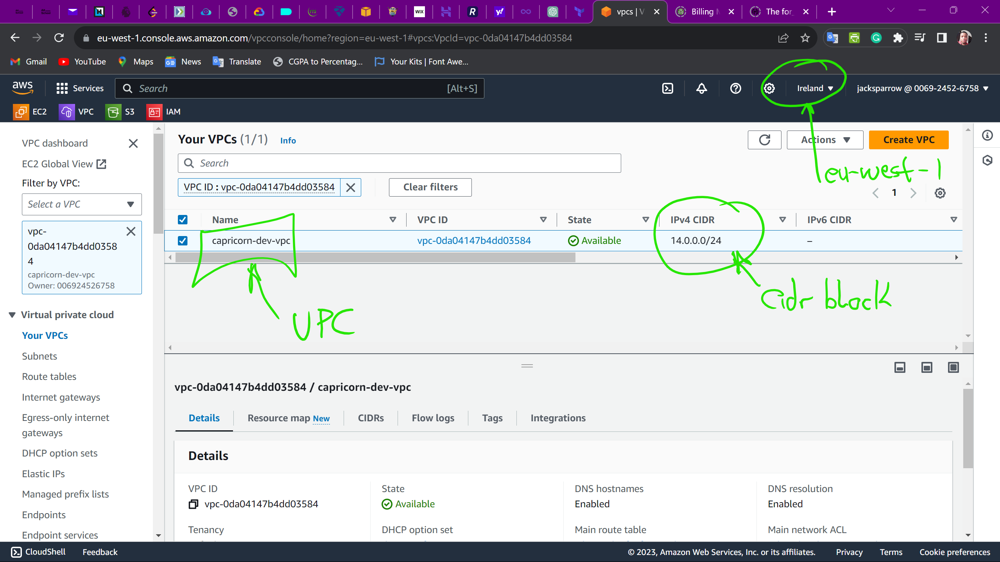

### This are the subnets created in eu-west-1

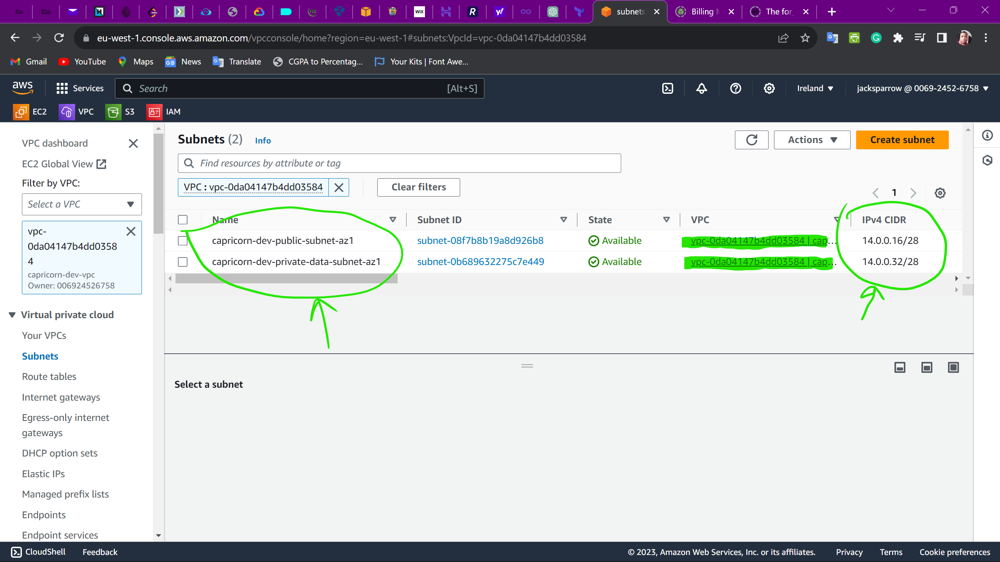

### This is the internet gateway created in eu-west-1

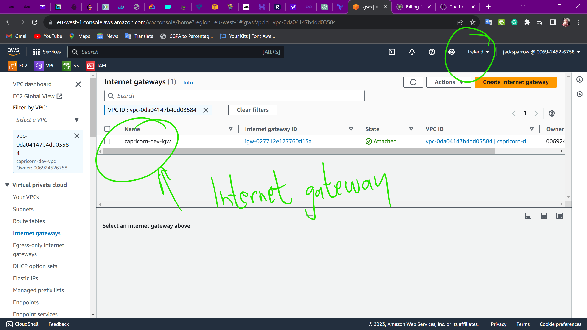

### This is the NAT gateway created in eu-west-1


### NAT Gateway test in eu-west-1


### This are the route tables created in eu-west-1

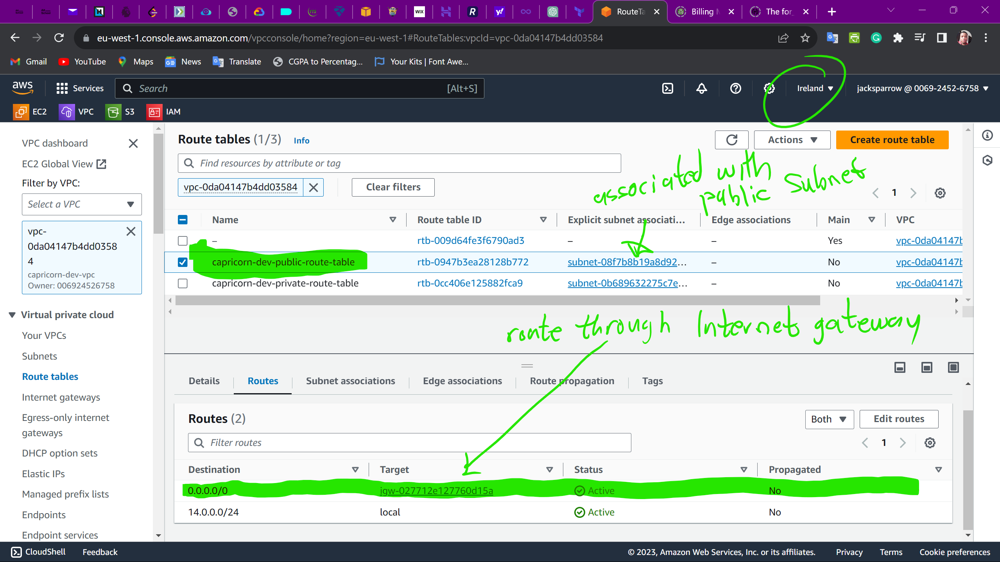

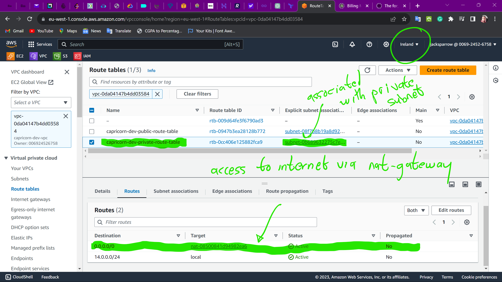

### This is the elastic IP created in eu-west-1

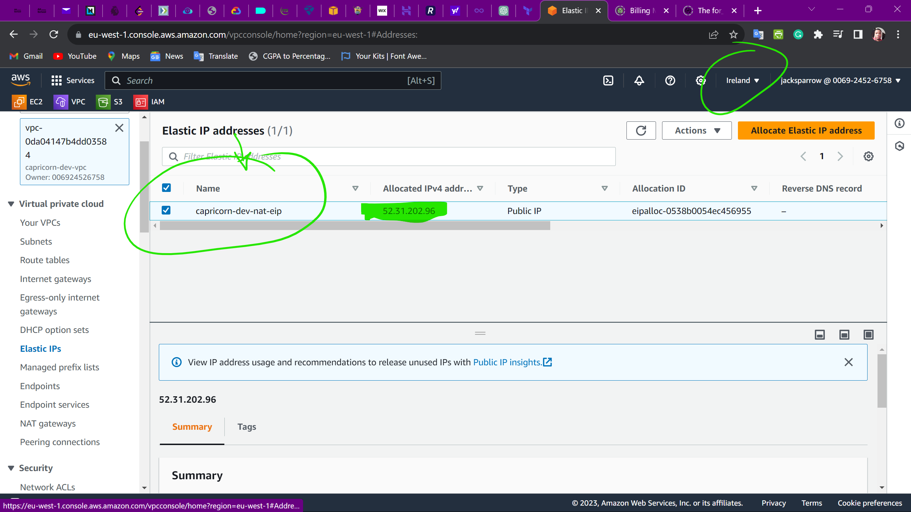

- **Security Groups**: Created security groups for public and private instances.

### This is the security group created for the public instances in eu-west-1

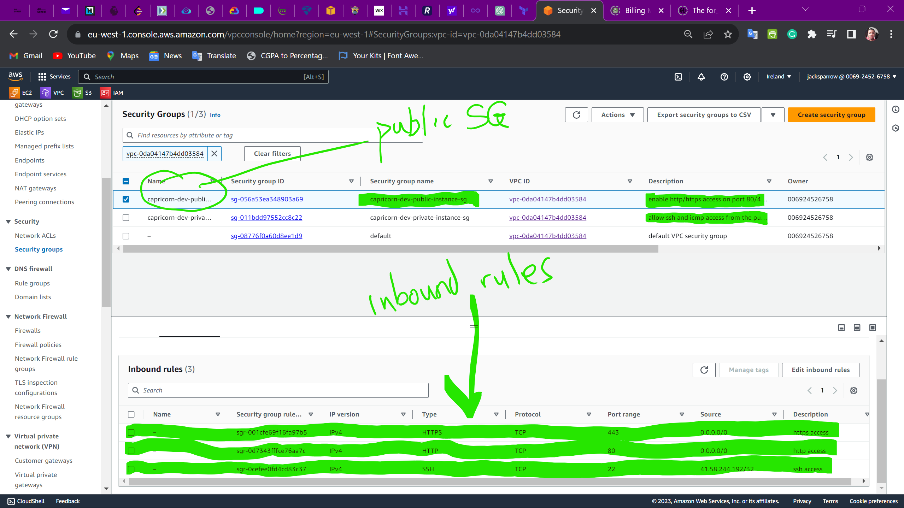

### SSH test from local device to the public instance

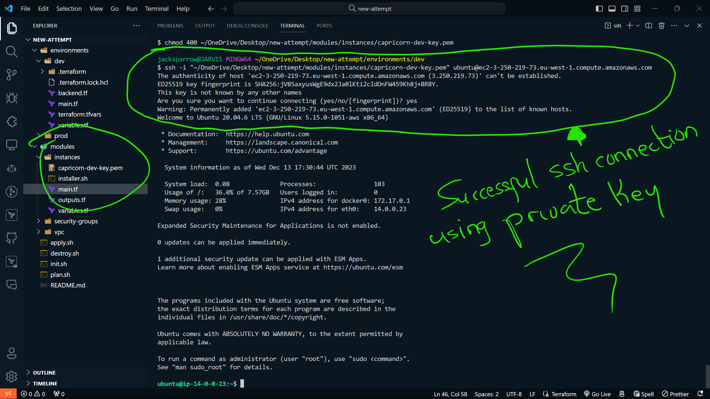

### This is the security group created for the private instances in eu-west-1


### Ping test from the public instance to the private instance


### SSH test from the public instance to the private instance

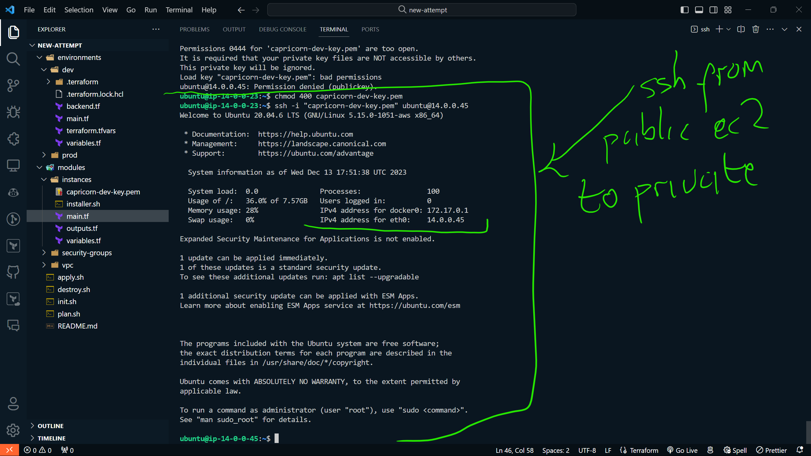

- **Instances**: Provisioned EC2 instances in both public and private subnets.

### This is where there module downloaded my private key

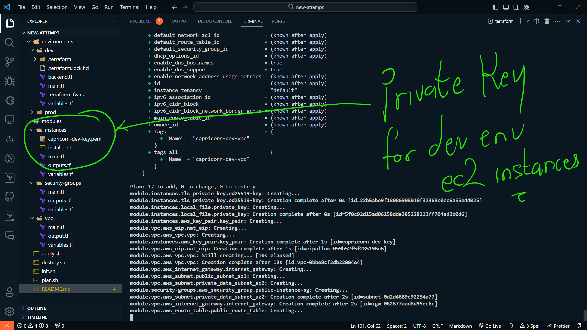

### this is the key pair created in eu-west-1

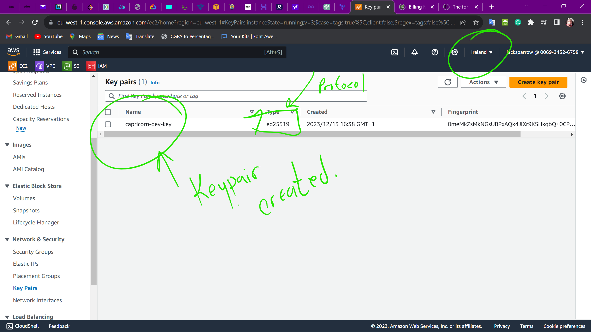

### This are for the instances created in eu-west-1

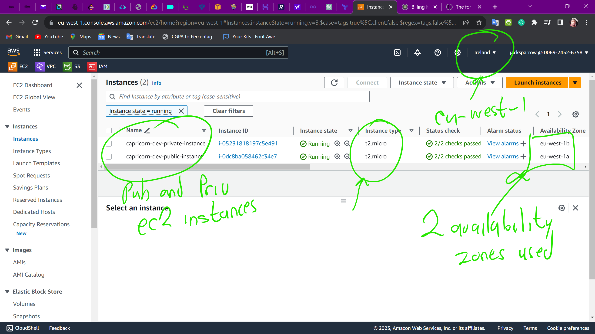

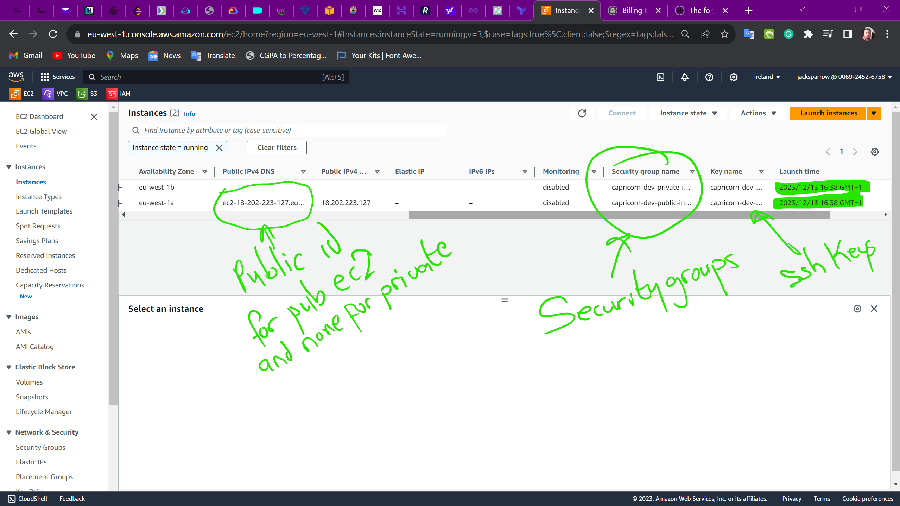

- **Installer Script**: Tested the installer script to ensure Ansible and Docker are installed on the instances.

### Tested the installer script on the public instance

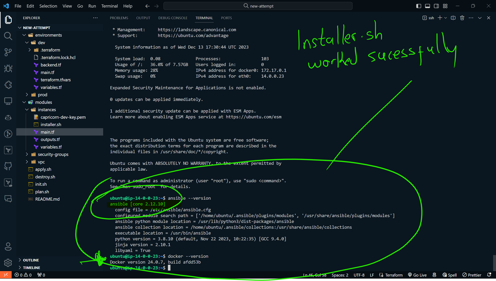

- **Environments**: Tested the dev and prod environments to ensure Terraform configurations are applied successfully. Their state files are stored in S3 buckets.

### State file for the dev environment

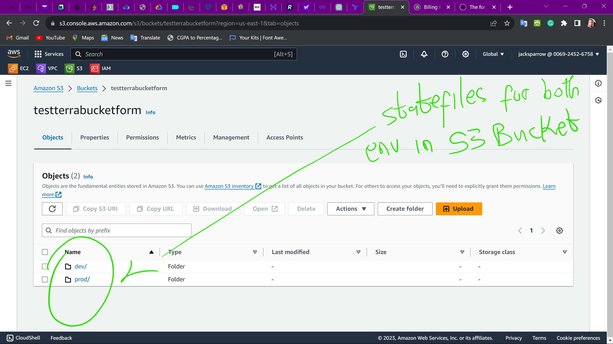

Using a remote backend to store the Terraform state file is a best practice that offers several advantages. It improves collaboration in team environments by providing shared access to state information and mitigating the risk of concurrent modifications through locking mechanisms. Security is enhanced as sensitive information is stored securely, preventing accidental exposure. Remote backends support versioning, facilitating a historical view of infrastructure changes and simplifying rollback procedures. Additionally, the flexibility of storage options, such as Amazon S3 or Azure Storage, ensures durability, scalability, and reliability. Adopting a consistent workflow across various environments is streamlined, with separate state files per environment, contributing to a more organized and controlled infrastructure management approach.

## 11. Conclusion

This documentation provides a comprehensive guide to the Terraform project structure, configurations, and best practices. For any questions or issues, refer to the relevant sections or contact the project maintainers.
